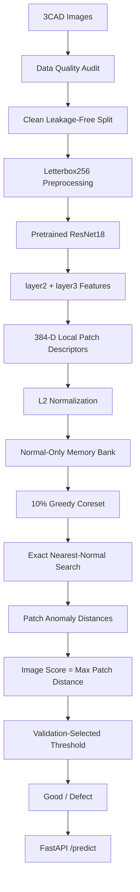

# Industrial Visual Anomaly Detection on 3CAD

A production-oriented industrial visual anomaly detection project built with **pretrained ResNet18 patch features**, a **normal-only memory bank**, **greedy coreset selection**, **nearest-normal feature scoring**, and **FastAPI model serving**.

The project focuses on the **Aluminum Camera Cover** category from the 3CAD dataset and explores not only model performance, but also the engineering issues that matter in industrial inspection:

- data quality
- train-test leakage
- preprocessing
- tiny and edge defects
- false positives / false negatives
- memory cost
- inference latency
- train-test feature consistency
- production deployment

> **Project status:** educational / portfolio implementation inspired by PatchCore-style memory-bank anomaly detection. It is **not an official reproduction of canonical PatchCore**.

---

## Highlights

- Audited the 3CAD dataset for image integrity, resolution variation, exact duplicates, and train-test leakage.
- Found that ImageNet-style `CenterCrop` completely removed the defect region in **95 / 1,077** defect samples.
- Replaced crop-based preprocessing with **Letterbox256** to preserve the full field of view.
- Used a frozen **ImageNet-pretrained ResNet18** and fused `layer2` + `layer3` intermediate features.
- Built a normal-only patch-feature memory bank and compressed it using a **10% greedy coreset**.
- Diagnosed a failed high-resolution experiment as a **train-test feature coverage mismatch**.
- Constructed a **clean leakage-free evaluation split** using exact SHA256 deduplication.
- Selected the operating threshold on validation data and evaluated once on an untouched final test set.
- Achieved **AUROC 0.9289**, **AP 0.9769**, **Recall 0.9387**, and **F1 0.9066** on the clean test set.
- Profiled the full inference pipeline and achieved approximately **20.44 ms mean end-to-end latency** on an RTX 4050 Laptop GPU.
- Deployed the anomaly detection pipeline as a **FastAPI REST API** with `/health` and `/predict` endpoints.

---

## Pipeline



## Why Normal-Only Anomaly Detection?

Instead of training a classifier for every possible defect type, the detector models the visual distribution of normal samples only.

During inference, local patch features from a test image are compared against the normal reference memory bank.

If a test patch is far from its nearest normal reference feature, it receives a higher anomaly score.

This approach is useful when:

- defect samples are rare
- defect classes are highly imbalanced
- not every future defect type is known during training
- normal production data is easier to collect than representative defect data

## Dataset

This project uses the 3CAD dataset and focuses on:

- Aluminum Camera Cover

The raw dataset is kept unchanged.

A separate clean evaluation pipeline was created to avoid contaminating the original data.

## Data Quality Audit

The global 3CAD audit found:

- 27,039 product images
- 38,501 total files including masks
- 245 image resolutions
- 120 exact duplicate groups
- 49 train-test leakage groups
- 109 cross-product duplicate groups
- 0 corrupt images

Near-duplicate candidates were also explored using perceptual hashing, but they were not automatically removed because highly repetitive industrial structures and tiny defects can create false-positive near-duplicate matches.

For the clean benchmark, only exact SHA256 duplicates were used for exclusion.

## Clean Leakage-Free Split

The clean Aluminum Camera Cover benchmark was built using the following rules:

- training data contains only normal images
- exact duplicates inside training are removed
- test images duplicated with training are removed
- exact duplicates inside the remaining test pool are removed
- the remaining evaluation pool is stratified by good / defect_type
- validation and test are split 50 / 50
- random seed = 42

### Final Clean Split

| Split | Images |
| --- | ---: |
| Train | 770 |
| Validation | 721 |
| Test | 719 |

Exact SHA256 overlap across train, validation, and test:

```text
0
```

This makes the final benchmark much more credible than the earlier exploratory split.

## CNN Feature Representation

The final pipeline uses a frozen ResNet18 pretrained on ImageNet.

For a 256×256 input:

- `layer2` → approximately 32×32×128
- `layer3` → approximately 16×16×256

`layer3` is bilinearly upsampled to match the spatial resolution of `layer2`.

The two feature maps are concatenated:

```text
128 + 256 = 384 dimensions
```

The resulting feature grid is:

```text
32 × 32 × 384
```

This gives:

```text
1,024 local patch descriptors per image
```

before invalid letterbox regions are filtered.

## Preprocessing Audit: CenterCrop vs Letterbox

The first version used an ImageNet-style:

```text
Resize
+
CenterCrop(224)
```

A mask-level audit showed that this preprocessing could physically remove important edge defects.

Specifically:

```text
95 / 1,077 defect masks
```

became completely empty after cropping.

The final pipeline therefore uses:

```text
Letterbox256
```

which:

- preserves the full field of view
- preserves aspect ratio
- pads instead of cropping
- uses a valid-region mask
- excludes padding-heavy feature positions from anomaly scoring

This was an important engineering lesson: preprocessing can directly change the physical information available to the model.

## Memory Bank and Coreset

The clean training set is converted into local normalized patch features.

```text
Full Clean Memory Bank
729,792 × 384 float32 features
≈ 1,069 MB
```

A greedy 10% coreset reduces this to:

```text
72,979 × 384
≈ 106.9 MB
```

This gives approximately:

```text
90% memory reduction
```

while retaining a representative subset of the normal feature space.

## Anomaly Scoring

All patch features are L2-normalized.

For every test patch:

- compare it against all normal coreset patches
- find the highest cosine similarity
- convert cosine similarity to Euclidean distance
- use the nearest-normal distance as the patch anomaly score

For normalized features:

```text
distance = sqrt(2 - 2 × cosine_similarity)
```

The image-level anomaly score is:

```text
maximum patch anomaly score
```

The final decision is:

```text
score < threshold  → good
score >= threshold → defect
```

## Threshold Selection

The operating threshold is not selected on the final test set.

Instead:

- inference is run on the validation set
- precision / recall / F1 are evaluated across meaningful score thresholds
- the threshold with the best validation F1 is selected
- the threshold is frozen
- final test evaluation is performed once

Selected validation threshold:

```text
0.569758
```

A recall-oriented validation operating point was also examined:

```text
Threshold ≈ 0.554521
Recall ≈ 0.9518
Precision ≈ 0.8369
```

This illustrates the production trade-off between defect escape rate and false alarms.

## Final Clean Benchmark

### Validation

| Metric | Result |
| --- | ---: |
| AUROC | 0.9010 |
| AP | 0.9660 |
| Precision | 0.8662 |
| Recall | 0.9369 |
| F1 | 0.9002 |

Selected threshold:

```text
0.569758
```

### Final Untouched Test Set

| Metric | Result |
| --- | ---: |
| AUROC | 0.9289 |
| Average Precision | 0.9769 |
| Precision | 0.8767 |
| Recall | 0.9387 |
| F1 | 0.9066 |

Confusion matrix:

```text
TN = 110
FP = 71
FN = 33
TP = 505
```

The final test threshold was fixed before evaluating the test set.

## Earlier Experimental Results

Before the clean benchmark was created, several exploratory versions were evaluated on the original dataset split.

| Version | Main Change | AUROC | AP | Precision | Recall | F1 |
| --- | --- | ---: | ---: | ---: | ---: | ---: |
| V1 | CenterCrop224 | 0.9210 | 0.9726 | 0.8922 | 0.9294 | 0.9104 |
| V2a | Letterbox256 | 0.8991 | 0.9659 | 0.9194 | 0.8793 | 0.8989 |
| V2b | High-res with train-test coverage mismatch | 0.4876 | 0.7267 | 0.7453 | 1.0000* | 0.8541 |
| V2c | Letterbox + full 32×32 coverage | 0.9166 | 0.9716 | 0.8836 | 0.9304 | 0.9064 |

\* V2b recall is misleading because almost all good images were predicted as defective.

These results are retained because they document the model-development and debugging process, but the clean leakage-free benchmark should be treated as the primary result.

## Debugging Lesson: V2b → V2c

A high-resolution V2b experiment collapsed to:

```text
AUROC = 0.4876
```

The key inconsistency was:

```text
Training memory:
only fixed stride-2 spatial positions

Inference:
all 32×32 spatial positions
```

This meant that some normal test patch locations were being compared against an incomplete normal reference distribution.

After rebuilding the training memory bank using full spatial coverage, performance recovered.

This reinforced an important production lesson:

> Before increasing model complexity or tuning thresholds, verify that training and inference represent the same feature space.

## Overkill vs Underkill

In industrial inspection:

### False Positive

Good unit → predicted defect

This can cause:

- overkill
- unnecessary rejection
- manual review
- lower production yield

### False Negative

Defective unit → predicted good

This can cause:

- underkill
- defect escape
- quality risk

For this reason, the project evaluates:

- AUROC
- Average Precision
- Precision
- Recall
- F1
- FP
- FN

rather than relying on accuracy alone.

## Inference Profiling

The clean V2c inference pipeline was profiled on an:

```text
NVIDIA RTX 4050 Laptop GPU
```

### Detailed Mean Latency

| Stage | Mean Latency |
| --- | ---: |
| Disk read / decode | 3.288 ms |
| RGB conversion | 1.069 ms |
| Resize | 2.960 ms |
| Canvas + paste | 0.053 ms |
| Valid-region mask | 0.138 ms |
| PIL → Tensor | 0.466 ms |
| Normalize | 0.602 ms |
| CPU → GPU | 0.323 ms |
| ResNet18 features | 2.403 ms |
| Patch processing | 0.572 ms |
| Nearest-neighbor search | 8.175 ms |
| End-to-end | 20.436 ms |

Approximate throughput from the broader benchmark:

```text
41.38 images / second
```

Peak CUDA memory during inference:

```text
≈ 451 MB
```

## Performance Bottleneck

The profiling showed that the largest single computational module was:

```text
brute-force nearest-neighbor search
```

rather than ResNet18.

Approximate comparison:

```text
ResNet18 feature extraction ≈ 2.4 ms
Nearest-neighbor search     ≈ 8.2 ms
```

This indicates that replacing the backbone purely for speed would provide less benefit than optimizing the search stage.

## Exact Search Optimization Experiment

Two exact GPU search implementations were benchmarked.

| Implementation | Mean | Median | P95 |
| --- | ---: | ---: | ---: |
| Full-Matrix GPU Search | 8.292 ms | 9.428 ms | 9.628 ms |
| Chunked GPU Exact Search | 8.581 ms | 9.788 ms | 10.049 ms |

Both implementations produced:

```text
Maximum score difference: 0
Prediction consistency: 100%
```

At the current coreset size, the full-matrix implementation was slightly faster and simpler, so it was retained.

## FastAPI Deployment

The anomaly detector is exposed through a REST API using FastAPI.

At application startup, the service loads:

- ResNet18
- clean coreset
- validation-selected threshold

once and keeps them resident for inference.

### API Flow

```text
Client
  ↓
POST /predict
  ↓
FastAPI
  ↓
Image decode
  ↓
Letterbox256
  ↓
ResNet18
  ↓
Patch features
  ↓
Nearest-normal comparison
  ↓
Anomaly score
  ↓
Threshold
  ↓
Good / Defect
  ↓
JSON response
```

## API Endpoints

### Root

```http
GET /
```

Example:

```json
{
  "message": "Industrial Visual Anomaly Detection API",
  "docs": "/docs",
  "health": "/health",
  "predict": "/predict"
}
```

### Health Check

```http
GET /health
```

Example response:

```json
{
  "status": "ok",
  "device": "cuda",
  "model_loaded": true,
  "coreset_size": 72979
}
```

### Prediction

```http
POST /predict
```

Upload an image and receive:

```json
{
  "prediction": "defect",
  "anomaly_score": 0.7312,
  "threshold": 0.569758,
  "latency_ms": 23.16
}
```

Swagger documentation is automatically available at:

```text
http://127.0.0.1:8000/docs
```

## Repository Structure

```text
industrial-visual-anomaly-detection/
│
├── README.md
├── .gitignore
│
├── notebooks/
│
├── reports/
│   └── clean_evaluation/
│
├── src/
│   ├── 00_data_audit/
│   ├── 01_feature_experiments/
│   ├── preprocessing_audit/
│   ├── clean_evaluation/
│   ├── api/
│   │   ├── __init__.py
│   │   ├── app.py
│   │   ├── inference_service.py
│   │   └── schemas.py
│   └── archive/
│
└── tests/
    └── api/
```

Large datasets, memory banks, model artifacts, temporary files, and local development files are intentionally excluded from the repository.

## Dataset Layout

The raw 3CAD dataset is not included.

Expected local layout:

```text
data/
└── 3CAD/
    └── Aluminum_Camera_Cover/
        ├── train/
        ├── test/
        └── ground_truth/
```

Please obtain the dataset from its authorized source and follow its applicable usage terms.

## Running the API

Python 3.12 was used during development.

Install the serving dependencies:

```bash
pip install fastapi "uvicorn[standard]" python-multipart pydantic
```

The project also requires:

- PyTorch
- torchvision
- Pillow
- NumPy
- Pandas
- Scikit-learn

Start the server from the project root:

```bash
uvicorn src.api.app:app --host 127.0.0.1 --port 8000
```

Then open:

```text
http://127.0.0.1:8000/docs
```

## Testing

API-related tests are located under:

```text
tests/api/
```

Run with:

```bash
python -m pytest tests/api -v --basetemp=.pytest_tmp
```

## What I Learned

This project reinforced that industrial AI performance depends on much more than choosing a larger neural network.

Key lessons include:

- data leakage can make evaluation unrealistically optimistic
- preprocessing can physically remove defects
- full-field-of-view preservation matters for edge defects
- spatial feature resolution affects tiny-defect sensitivity
- train-test feature consistency is critical
- validation-based threshold selection is more defensible than test-set tuning
- precision and recall must be interpreted in terms of overkill and underkill
- memory-bank size directly affects serving cost
- latency profiling should identify the actual bottleneck before optimization
- deployment requires more than a notebook or evaluation script
- failed experiments can reveal important engineering problems

## Future Improvements

Potential next steps include:

- approximate nearest-neighbor search with FAISS
- stronger pretrained visual backbones
- pixel-level anomaly localization
- anomaly heatmap generation
- per-defect-type performance analysis
- batch inference
- Docker deployment
- structured logging and monitoring
- experiment tracking
- support for additional 3CAD product categories
- production calibration for different recall / false-positive requirements

## Tech Stack

- Python
- PyTorch
- Torchvision
- ResNet18
- Pillow
- NumPy
- Pandas
- Scikit-learn
- FastAPI
- Uvicorn
- Pytest
- CUDA

## Author

Ong Shun Sheng

Computer Science graduate interested in:

- AI Engineering
- Computer Vision
- Machine Learning
- Data Engineering
- Production AI Systems

## License

No open-source license has been selected yet.

If the repository is later released for reuse, an appropriate license should be selected while also respecting the usage terms of the dataset and third-party dependencies.
