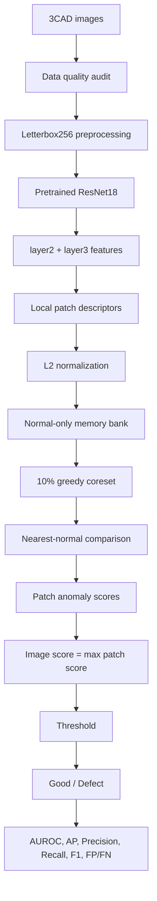
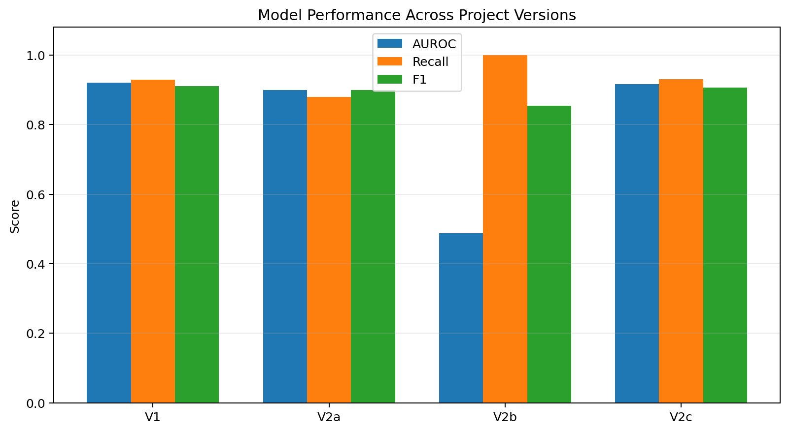

# Industrial Visual Anomaly Detection on 3CAD

A hands-on industrial visual anomaly-detection project using **pretrained ResNet18 patch features**, a **normal-only memory bank**, **greedy coreset selection**, and **nearest-normal feature scoring**.

The project focuses not only on model performance, but also on the engineering issues that matter in visual inspection: **data quality, leakage, preprocessing, tiny defects, false positives / false negatives, memory cost, and train-test pipeline consistency**.

> **Project status:** educational / portfolio implementation inspired by PatchCore-style memory-bank anomaly detection. It is **not an official reproduction of canonical PatchCore**.

## Highlights

- Audited the 3CAD dataset for image integrity, resolution variation, exact duplicates, and train-test leakage.
- Found that ImageNet-style `CenterCrop` completely removed the defect region in **95 / 1,077** defect samples.
- Replaced crop-based preprocessing with **Letterbox256** to preserve the full field of view.
- Used a frozen **ImageNet-pretrained ResNet18** and fused `layer2` + `layer3` intermediate features.
- Built a normal-only patch-feature memory bank and compressed it with a **10% greedy coreset**.
- Diagnosed a failed high-resolution experiment as a **train-test feature coverage mismatch**.
- Final V2c result on the existing dataset split: **AUROC 0.9166**, **AP 0.9716**, **Recall 0.9304**, **F1 0.9064**.

## Pipeline



## Why normal-only anomaly detection?

Instead of requiring labeled examples for every possible defect type, the detector represents the distribution of **normal** visual patterns. During inference, a test patch that is far from its nearest normal reference feature receives a higher anomaly score.

This can be useful when defects are rare, imbalanced, or incomplete in the training set.

## CNN feature representation

The final version uses a frozen ResNet18 backbone.

For a 256×256 input:

- `layer2` retains stronger local / spatial detail;
- `layer3` provides stronger contextual representation;
- `layer3` is upsampled and concatenated with `layer2`;
- the final V2c feature grid is **32×32** with **384 channels**;
- this produces **1,024 local descriptors per image** before valid-region filtering.

## Preprocessing audit: CenterCrop vs Letterbox

The original V1 used an ImageNet-style resize + `CenterCrop(224)` pipeline. A mask audit showed that **95 / 1,077** defect masks became completely empty after cropping, especially for edge defects.

The later pipeline uses aspect-ratio-preserving **Letterbox256** plus a valid-region mask. This avoids physically cropping away edge defects and allows padding-heavy feature positions to be excluded.

## Memory bank and coreset

V2c stores valid normal patch features as the reference memory:

```text
744,000 × 384 float32 features
≈ 1.09 GB
```

A traditional greedy farthest-first coreset, using a random projection from 384 → 64 dimensions for selection, keeps 10% of the representatives:

```text
74,400 × 384
≈ 109 MB
```

This reduces memory by about **90%** while preserving a representative normal feature set.

## Results



| Version | Main change | AUROC | AP | Precision | Recall | F1 | FP | FN |
|---|---|---:|---:|---:|---:|---:|---:|---:|
| V1 | CenterCrop224 | 0.9210 | 0.9726 | 0.8922 | 0.9294 | 0.9104 | 121 | 76 |
| V2a | Letterbox256 | 0.8991 | 0.9659 | 0.9194 | 0.8793 | 0.8989 | 83 | 130 |
| V2b | High-res diagnostic, mismatched coverage | 0.4876 | 0.7267 | 0.7453 | 1.0000* | 0.8541 | 368 | 0 |
| V2c | Letterbox + full 32×32 coverage | **0.9166** | **0.9716** | 0.8836 | **0.9304** | **0.9064** | 132 | **75** |

\* V2b recall is misleading because almost all good images were predicted as defective.

See [`reports/results_summary.md`](reports/results_summary.md) for interpretation and evaluation caveats.

## Debugging lesson: V2b → V2c

A high-resolution V2b experiment collapsed to **AUROC 0.4876**.

The key inconsistency was:

```text
Training memory: only fixed stride-2 spatial positions
Inference:       all 32×32 spatial positions
```

Normal test patches could therefore be compared against an incomplete normal reference distribution. After rebuilding the memory bank with **full 32×32 train coverage**, V2c recovered to **AUROC 0.9166**.

This experiment reinforced an important production lesson: before tuning thresholds or increasing model complexity, verify that the **training and inference pipelines represent the same feature space**.

## Overkill vs underkill

In an inspection setting:

- **False positive (FP)** → a good unit is predicted as defective → **overkill** / unnecessary rejection or review.
- **False negative (FN)** → a defective unit is predicted as good → **underkill / escape**.

The project therefore evaluates both ranking metrics and operating-point metrics rather than relying on accuracy alone.

## Repository structure

```text
industrial-visual-anomaly-detection/
├── README.md
├── requirements.txt
├── .gitignore
├── notebooks/
│   └── project_overview.ipynb
├── reports/
│   └── results_summary.md
├── assets/
│   └── model_performance_comparison.png
└── src/
    ├── 00_data_audit/
    ├── 01_feature_experiments/
    ├── preprocessing_audit/
    ├── v1_centercrop224/
    ├── v2_letterbox256/
    └── archive/
```

## Setup

Python 3.12 was used during development.

```bash
python -m venv .venv
```

Windows PowerShell:

```powershell
.\.venv\Scripts\Activate.ps1
pip install -r requirements.txt
```

For GPU acceleration, install the PyTorch build appropriate for your CUDA environment from the official PyTorch installation instructions.

## Dataset layout

The raw 3CAD dataset is **not included** in this repository. Place it under:

```text
data/
└── 3CAD/
    └── Aluminum_Camera_Cover/
        ├── train/
        ├── test/
        └── ground_truth/
```

Please obtain the dataset from its authorized source and follow its applicable usage terms.

## Suggested run order

For a quick project review, open:

```text
notebooks/project_overview.ipynb
```

It summarizes the complete workflow and keeps heavy reconstruction steps disabled by default.

For the original experiment sequence:

```text
src/00_data_audit/1_inspect_data.py
src/00_data_audit/2_audit_images.py
src/00_data_audit/3_audit_duplicates.py
src/00_data_audit/4_audit_near_duplicates.py

src/preprocessing_audit/20_audit_crop_loss.py
src/v2_letterbox256/21_audit_letterbox_retention.py

src/v2_letterbox256/31_build_full32_memory_bank.py
src/v2_letterbox256/32_build_full32_coreset.py
src/v2_letterbox256/33_evaluate_full32_image_level.py
```

## Evaluation caveat

The current headline metrics are **exploratory results on the existing dataset split**. The duplicate audit identified exact duplicate groups and train-test overlap. Therefore, these numbers should not be treated as a final leakage-free estimate of generalization performance.

A stricter follow-up should:

1. construct a cleaned leakage-free split;
2. reserve a validation / calibration set;
3. select thresholds on validation data;
4. report final performance once on an untouched test set.

This limitation is intentionally documented because data leakage and evaluation design are part of the engineering problem, not something to hide.

## What I learned

This project reinforced that industrial AI performance depends on much more than choosing a larger model:

- data quality and leakage matter;
- preprocessing can physically remove defects;
- spatial resolution changes tiny-defect sensitivity;
- FP/FN trade-offs need business interpretation;
- memory and latency matter for deployment;
- train-test pipeline consistency is critical;
- failed experiments can reveal more than headline metrics.

## License

No open-source license has been selected yet. If you plan to make the repository public and allow reuse, add a license that matches how you want others to use your code and the applicable dataset / dependency terms.
